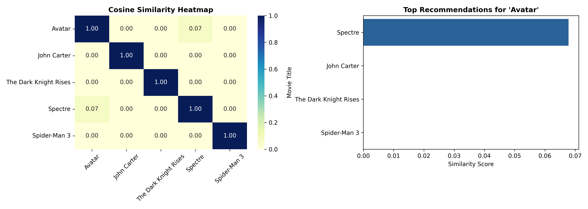

# Content-Based Movie Recommendation Engine

An end-to-end Natural Language Processing (NLP) recommendation system built with Python, `pandas`, and `scikit-learn`. The model converts movie plot descriptions into high-dimensional numerical vectors and computes pairwise similarities to generate content-based movie recommendations.

---

## Technical Overview

1. **Text Vectorization (TF-IDF):** 
   Converts textual plot overviews into TF-IDF (Term Frequency-Inverse Document Frequency) feature vectors while filtering standard English stop words.
2. **Similarity Metric (Cosine Similarity):** 
   Computes the cosine of the angle between document vectors to determine narrative similarity:
   
   $$\text{Cosine Similarity}(A, B) = \frac{A \cdot B}{\Vert{}A\Vert{} \Vert{}B\Vert{}}$$

---

## Project Structure

```text
.
├── recommender.py     # Main Python recommendation script
├── requirements.txt   # Project dependencies
└── README.md          # Project documentation

---

## Visual Output


